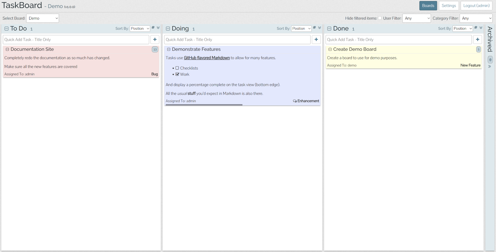

<!--
N.B.: This README was automatically generated by https://github.com/YunoHost/apps/tree/master/tools/readme_generator
It shall NOT be edited by hand.
-->

# TaskBoard for YunoHost

[](https://dash.yunohost.org/appci/app/taskboard)  

[](https://install-app.yunohost.org/?app=taskboard)

*[Lire ce readme en français.](./README_fr.md)*

> *This package allows you to install TaskBoard quickly and simply on a YunoHost server.
If you don't have YunoHost, please consult [the guide](https://yunohost.org/#/install) to learn how to install it.*

## Overview

A Kanban-inspired app for keeping track of things that need to get done.
The goal of TaskBoard is to provide a simple and clean interface to a functional and minimal application for keeping track of tasks. It's not trying to be the next Trello or LeanKit.

**Shipped version:** v1.0.2~ynh1

**Demo:** https://taskboard.matthewross.me/demo

## Screenshots



## :red_circle: Antifeatures

- **Package not maintained**: This YunoHost package is not maintained and needs adoption.

## Documentation and resources

* Official app website: <http://taskboard.matthewross.me/>
* Upstream app code repository: <https://github.com/kiswa/TaskBoard>
* YunoHost Store: <https://apps.yunohost.org/app/taskboard>
* Report a bug: <https://github.com/YunoHost-Apps/taskboard_ynh/issues>

## Developer info

Please send your pull request to the [testing branch](https://github.com/YunoHost-Apps/taskboard_ynh/tree/testing).

To try the testing branch, please proceed like that.

``` bash
sudo yunohost app install https://github.com/YunoHost-Apps/taskboard_ynh/tree/testing --debug
or
sudo yunohost app upgrade taskboard -u https://github.com/YunoHost-Apps/taskboard_ynh/tree/testing --debug
```

**More info regarding app packaging:** <https://yunohost.org/packaging_apps>