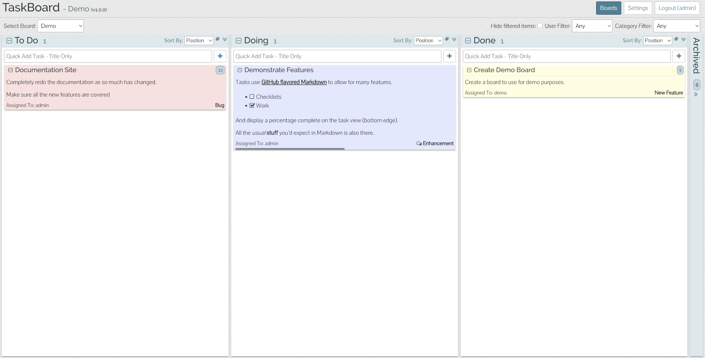

# TaskBoard pour YunoHost

[](https://dash.yunohost.org/appci/app/taskboard)    
[](https://install-app.yunohost.org/?app=taskboard)

*[Read this readme in english.](./README.md)*
*[Lire ce readme en français.](./README_fr.md)*

> *Ce package vous permet d'installer TaskBoard rapidement et simplement sur un serveur YunoHost.
Si vous n'avez pas YunoHost, regardez [ici](https://yunohost.org/#/install) pour savoir comment l'installer et en profiter.*

## Vue d'ensemble

A Kanban-inspired app for keeping track of things that need to get done.
The goal of TaskBoard is to provide a simple and clean interface to a functional and minimal application for keeping track of tasks. It's not trying to be the next Trello or LeanKit.

**Version incluse :** 1.0.2~ynh2

**Démo :** https://taskboard.matthewross.me/demo

## Captures d'écran



## Documentations et ressources

* Site officiel de l'app : http://taskboard.matthewross.me/
* Dépôt de code officiel de l'app : https://github.com/kiswa/TaskBoard
* Documentation YunoHost pour cette app : https://yunohost.org/app_taskboard
* Signaler un bug : https://github.com/YunoHost-Apps/taskboard_ynh/issues

## Informations pour les développeurs

Merci de faire vos pull request sur la [branche testing](https://github.com/YunoHost-Apps/taskboard_ynh/tree/testing).

Pour essayer la branche testing, procédez comme suit.
```
sudo yunohost app install https://github.com/YunoHost-Apps/taskboard_ynh/tree/testing --debug
ou
sudo yunohost app upgrade taskboard -u https://github.com/YunoHost-Apps/taskboard_ynh/tree/testing --debug
```

**Plus d'infos sur le packaging d'applications :** https://yunohost.org/packaging_apps